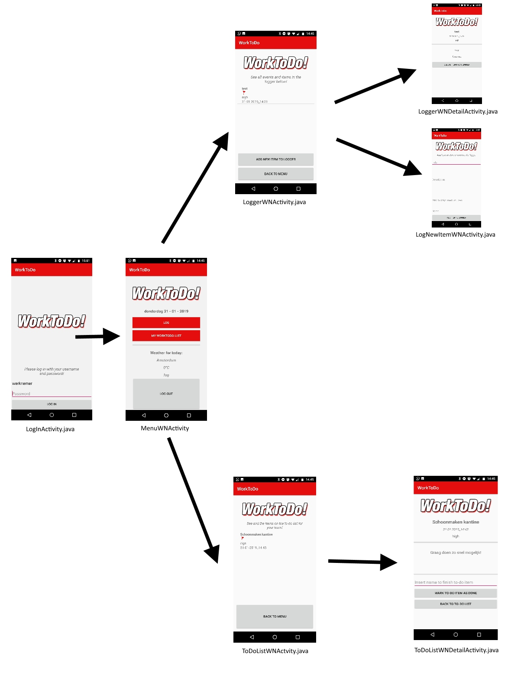

WorkToDo!
===================

## Duncan Vrösch (11211490) ##

## Final Report: Minor Programmeren, Universiteit van Amsterdam (2018 / 2019) ##

 

Deze app maakt online communicatie tussen werknemers en werkgevers mogelijk door middel van het uitwisselen van gebeurtenissen in een logboek en een to-do list.

### Overview activities ###
Ik heb me beperkt tot het visualiseren van de activities van de werknemerskant. Het systeem voor de werkgever werkt wat dat betreft hetzelfde.

### Classes ###
De class Helper wordt gebruikt om de informatie van een to-do item, done item, of log item op te slaan. Op deze manier wordt het mogelijk om deze informatie ook weer weer te geven in de lijst van bijvoorbeeld het logboek. Daarnaast wordt deze class aangeroepen om ook informatie te kunnen plaatsen in de DetailActivity's. Kortom, voor iedere activiteit worden de relevante attributes gepakt en getoond door middel van de Helper class en de bijbehorende adapter. In onderstaande tabel kan worden bekeken welke zaken er worden opgeslagen in de Helper class.

Hiernaast bestaat er een class Account. Deze wordt gebruikt om de informatie van een account op te slaan. Dit betreft de 'username' en 'password' van een gebruiker. Op deze manier wordt het mogelijk om deze informatie ook weer weer te geven in accountlijst die beschikbaar is voor de werkgever. In onderstaande tabel kan ook worden bekeken welke zaken er worden opgeslagen in de Account class.

<table>
<tr><th> Helper </th><th> Account </th></tr>
<tr><td>

|attribute| type |
|--|--|
| title | string|
| name | string | 
| description | string |
| priority | string |
| timestamp | string |

</td><td>

|attribute| type |
|--|--|
|movieId| string|
| username | string | 
| password | string |

</td></tr> </table>

### Adapters ###
Het project heeft vier adapters: DoneAdapter, ToDoAdapter, LoggerAdapter en AccountAdapter,. De eerste drie adapters zorgen ervoor dat de gebruiker de naam, beschrijving, tijd en datum, naam en prioriteit te zien krijgen in de lijsten van het logboek, to-do list en de done-list, en de detailactivity's ervan. De AccountAdapter werkt hetzelfde, alleen zet deze alleen username en password om zodat het visueel zichtbaar wordt voor de werkgever in de AccountListWGActivity en de AccountDetailWGActivity.

### Database ###
Om items blijvend te kunnen opslaan in een database, wordt gebruik gemaakt van de Rester Database: https://github.com/stgm/rester. In de database worden verschillende zaken opgeslagen en bestaan er vier entry's: de to-do list, een logboek, een done-list en een accountlist. Hieronder staat alles keurig en overzichtelijk op een rijtje van wat de entry's bevatten.

<table>
<tr><th> To-Do List </th><th> Logger </th></tr>
<tr><td>

|key| value |
|--|--|
| id | int|
| name | string | 
| description | string |
| title | string |
| priority | string |
| timestamp | string |

</td><td>

|key| value |
|--|--|
| id | int|
| name | string | 
| description | string |
| title | string |
| priority | string |
| timestamp | string |

</td></tr> </table>

<table>
<tr><th> AccountList </th><th> DoneList </th></tr>
<tr><td>

|key| value |
|--|--|
| id | int|
| password | string | 
| username | string |

</td><td>

|key| value |
|--|--|
| id | int|
| name | string | 
| description | string |
| title | string |
| priority | string |
| timestamp | string |

</td></tr> </table>

### Postrequests ###
Het project bevat, net als vier lijsten, dus ook  vier verschillende PostRequests die worden gebruikt om specifieke informatie aan de online database toe te voegen. Kortom, AccountPost.java wordt gebruikt om een nieuw account toe te voegen aan de AccountList. DonePost.java wordt gebruikt om een to-do item toe te voegen aan de DoneList. ToDoPost.java wordt gebruikt om een to-do item toe te voegen aan de ToDoList. En LoggerPost.java wordt gebruikt om een log item toe te voegen aan de Logger. 

### Changes and challenges ###
Het gehele idee dat aan het begin van het project is bedacht, is achteraf ook mogelijk gebleken. Toch zijn er enkele zaken die anders en aangepast zijn geworden. Hiernaast zijn er verschillende features toegevoegd.

In mijn originele proposal heb ik het bijvoorbeeld niet gehad over de done list. Deze lijst is later ontwikkeld waardoor de werkgever op een rijtje kan zien welk to-do taken zijn afgerond. Dit plan was er oorspronkelijk nog niet. Het is een functie geweest die essentieel is gebleken na de eerste week om een manier te hebben om to-do items af te vinken. 

Hiernaast bestaat er nu ook een mogelijkheid voor de werkgever om accounts aan te maken voor werknemers. Deze functie heb ik ook niet eerst benoemd en niet ontwikkeld aangezien ik werkte met hardcoded accounts. Helaas is dit erg statisch, waardoor ik gedurende het proces heb gekozen voor een dynamische accountlijst die communiceert via een database. Hierdoor worden werknemers die ontslag nemen uitgesloten van deelname aan de app, en kan er voor nieuwe werknemers een persoonlijk account aangemaakt worden. Helaas heeft ieder persoonlijk account geen verschil ten opzichte van elkaar. Dit zou wel interessant zijn voor uitbreiding aangezien er dan ook persoonlijke to-do listen kunnen worden gemaakt per werknemer. Echter, dit is nu niet aan de orde.

Het design van de app is onveranderd gebleven en komt grotendeels overeen met het eerdere ontwerp in de Proposal. Daarnaast zijn er zoals beschreven twee aparte platforms gemaakt voor aan de ene kant de werknemer en aan de andere kant de werkgever. Om deze te scheiden heb ik gebruik gemaakt van elk een aparte activiteit.

Een probleem tijdens het maken van de app vormde zich rond de API. Deze werkte vrij snel om het recente weer vanuit Amsterdam te kunnen visualiseren in het menu van de app voor zowel werknemer als werkgever. Helaas is het me de laatste dagen noch gelukt om een weerbericht voor over 3 uur  noch een weerbericht voor de huidige locatie te implementeren. Hierdoor is het weerbericht van nu wel werkend, maar erg minimaal naar mijn mening. 

### Defence ###
Door de gemakkelijke en laagdrempelige interface van de app, ben ik zeer tevreden over het resultaat. Het doel om met deze app taken en communicatie tussen werkgever en werknemer duidelijk en helder te maken is volgens mij gelukt. Daarentegen biedt de app slechts een optie om zaken toe te voegen aan één to-do list: persoonlijke to-do listen kunnen niet gemaakt worden. Aangezien ik wel heb gekozen voor persoonlijke werknemersaccounts, zou het een optie zijn om deze persoonlijke to-do listen te ontwikkelen als ik meer tijd had gehad. Daarentegen is de app nu zeer geschikt voor een team werkende mensen die dagelijks bepaalde zaken moeten uitvoeren, zonder daarbij onderscheid in de app te maken wie welke taak op zich neemt. Helaas heb ik het niet meer gehaald om een foto-optie toe te voegen aan het logboek. Dit zou ik wel hebben gedaan als ik meer tijd had gehad zodat het bericht in een logboek duidelijker wordt met visueel beeld erbij.
